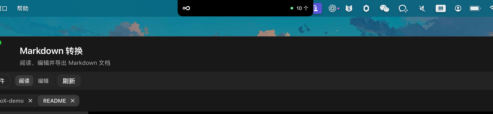
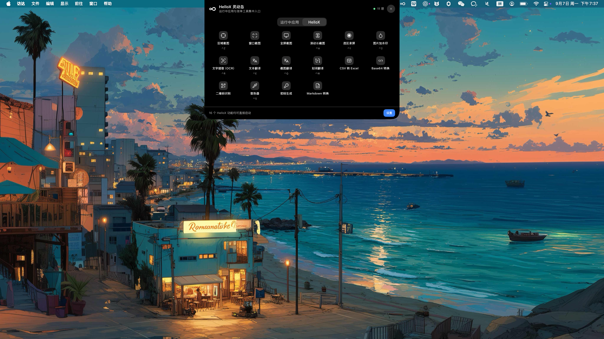
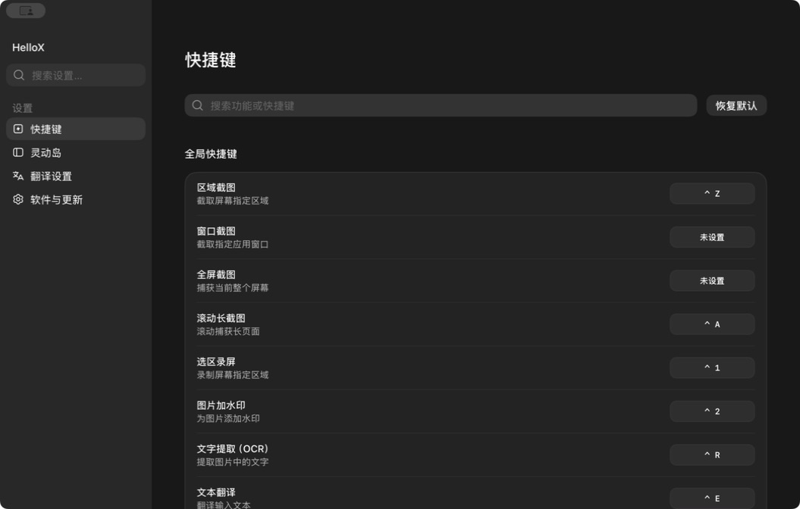
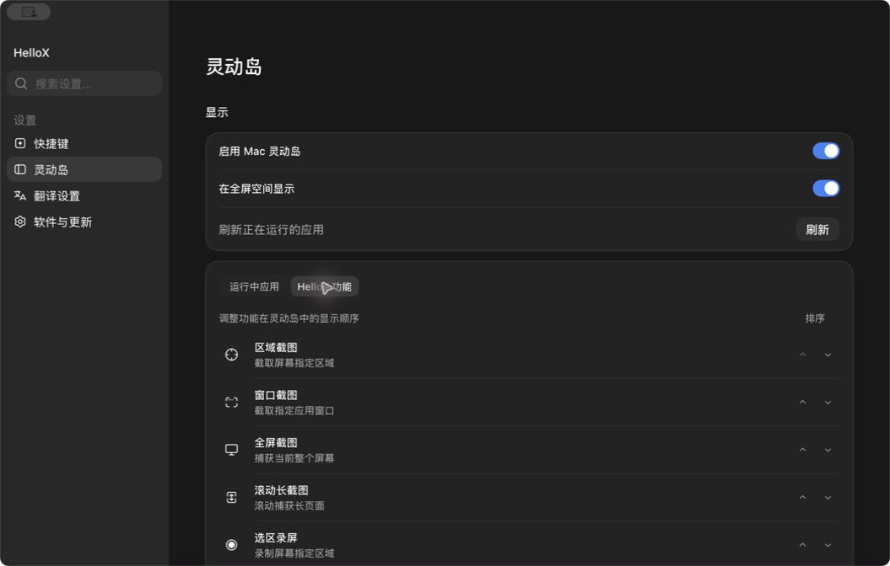
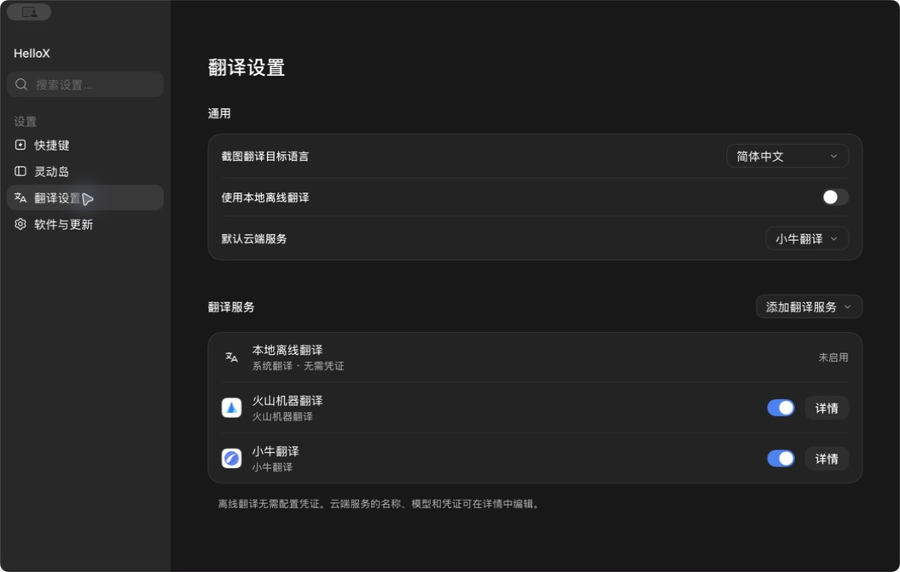
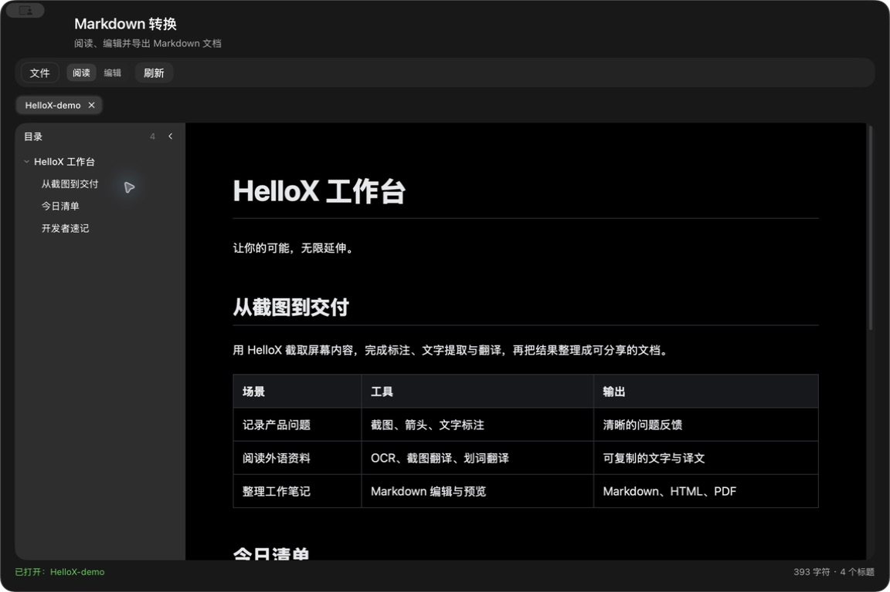

<p align="center">
  
</p>

# HelloX

**让你的可能，无限延伸**

原生 macOS 效率工具 · Mac 灵动岛 · 截图标注 · OCR 与翻译 · 录屏 · Markdown

[下载安装](https://github.com/HelloX-ZhaoWen/hellox/releases) · [Mac 灵动岛](#mac-灵动岛) · [界面预览](#界面预览) · [快速上手](#快速上手) · [源码构建](#从源码构建) · [反馈问题](https://github.com/HelloX-ZhaoWen/hellox/issues)

HelloX 将截图、标注、文字提取、翻译和日常小工具整合到一个原生 Mac 应用中。无论是记录产品问题、阅读外语资料，还是整理工作笔记，都可以通过菜单栏、全局快捷键或 Mac 灵动岛快速调用。

应用使用 Swift、SwiftUI 和 AppKit 构建，支持 Apple Silicon 与 Intel Mac。截图、标注和 OCR 在本机处理，翻译可选择 macOS 系统离线能力或自行配置的云端服务；无需 HelloX 账号，不包含广告、分析或遥测 SDK。

## 主要功能

| 功能 | 可以做什么 |
| --- | --- |
| 截图与长截图 | 区域、窗口、全屏截图；手动滚动捕获长页面，自动拼接内容 |
| 图片标注 | 矩形、高亮、椭圆、箭头、画笔、文字、步骤编号、马赛克、裁剪与水印 |
| 文字提取 | 基于 Apple Vision 识别图片文字，方便复制和继续编辑 |
| 多种翻译入口 | 文本翻译、截图翻译、划词翻译；支持本地离线、智谱、百度、阿里云、火山机器翻译和小牛翻译 |
| 图片置顶 | 将图片悬浮置顶，便于对照资料与跨窗口工作 |
| 选区录屏 | 录制指定屏幕区域并保存为 MP4；当前版本不录制音频 |
| Mac 灵动岛 | 屏幕顶部的应用与工具入口；展开后切换运行中应用，一键启动全部 16 项 HelloX 功能，支持应用置顶、功能排序和全屏空间显示 |
| Markdown 工作台 | 多文档标签、目录导航、阅读与编辑，以及 HTML / PDF 导出 |
| 实用工具 | CSV 转 Excel（`.xlsx`）、Base64 编解码、二维码识别、屏幕取色与随机密码生成 |
| 快捷键与设置 | 自定义全局快捷键、搜索功能与设置，以及检查软件更新 |

## Mac 灵动岛

HelloX 灵动岛将运行中应用与效率工具集中在屏幕顶部。收起时以黑色胶囊显示 HelloX 标识和应用数量，点击后展开为工具面板，方便在工作中随时调用。

### 收起状态：屏幕顶部的轻量入口

灵动岛位于屏幕顶部中央，与当前工作窗口共存。无需先打开设置窗口，即可进入应用与工具面板。



### 展开状态：应用与 16 项工具集中访问

- **运行中应用**：查看应用列表并点击切换，支持将常用应用置顶和调整顺序，便于访问菜单栏溢出项目对应的应用。
- **HelloX 工具**：通过图标网格直接启动全部 16 项功能，覆盖截图、录屏、水印、OCR、翻译、CSV 转 Excel、Base64 转换、二维码识别、取色、密码生成和 Markdown。
- **快捷键提示**：已配置快捷键的工具会在名称下方显示按键组合，鼠标操作与键盘调用均可使用。
- **显示与排序**：从面板右下角进入设置，管理灵动岛开关、全屏空间显示和功能顺序。



以上为实际界面截图，应用数量和快捷键随当前运行状态与个人配置变化。

## 界面预览

以下截图来自实际运行的 HelloX，使用深色外观。截图中的快捷键和翻译服务为当前演示配置，默认快捷键见下文。

### 快捷键设置

集中查看功能说明、搜索操作并配置快捷键。



### 灵动岛设置

管理灵动岛显示方式，并调整 HelloX 功能入口的顺序。



### 翻译服务

选择目标语言，管理本地离线翻译与云端服务。



### Markdown 工作台

通过目录导航阅读文档，也可以切换编辑模式并导出 HTML 或 PDF。



截图使用的文档：[HelloX 演示文档](docs/examples/HelloX-demo.md)。

## 安装

**系统要求：macOS 15 或更高版本，Apple Silicon 或 Intel Mac。**

当前版本：**v1.0.5（构建 98）**。查看[更新说明](docs/releases/v1.0.5.md)，或直接下载 [DMG 安装镜像](https://github.com/HelloX-ZhaoWen/hellox/releases/download/v1.0.5/HelloX-1.0.5.dmg) / [PKG 安装包](https://github.com/HelloX-ZhaoWen/hellox/releases/download/v1.0.5/HelloX-1.0.5.pkg)。

此版本未经过 Apple 公证；首次安装时，macOS 可能要求在“系统设置 → 隐私与安全性”中确认。

1. 前往 [GitHub Releases](https://github.com/HelloX-ZhaoWen/hellox/releases) 下载发布的 DMG 安装镜像。
2. 打开 DMG，运行其中的 `安装 HelloX.pkg`，按提示完成安装。
3. 从“应用程序”启动 HelloX。

当前版本要求应用安装在 `/Applications/HelloX.app`，无法直接从 DMG 或 `build/` 目录运行应用包。

### 权限说明

| 权限或资源 | 使用场景 |
| --- | --- |
| 屏幕录制 | 读取选定屏幕或窗口，用于截图、录屏等功能 |
| 辅助功能 | 滚动长截图，以及主动触发划词翻译时读取选中文字 |
| 系统翻译语言资源 | 首次使用相应语言时可能需要联网下载，下载后可使用系统离线翻译 |

可在 macOS“系统设置 → 隐私与安全性”中管理屏幕录制和辅助功能权限。云端翻译与软件更新需要网络连接。

## 快速上手

- **灵动岛**：点击屏幕顶部的 HelloX 胶囊展开面板，在“运行中应用”和“HelloX”之间切换；点击应用切换窗口，点击工具直接启动对应功能。右下角“设置”可管理显示方式与排列顺序。
- **截图与标注**：从菜单栏或灵动岛选择“区域截图”，拖动框选内容，使用标注工具处理后复制或保存。
- **滚动长截图**：选择“滚动长截图”，框定区域后手动滚动页面，由应用拼接捕获内容。
- **OCR 与翻译**：使用“文字提取”识别图片内容；使用“截图翻译”处理屏幕文字，或选中文字后触发“划词翻译”。云端服务需先在“翻译设置”中配置。
- **Markdown**：打开“Markdown 转换”工具并导入文档，也可以在访达中右键 `.md` 文件，选择“打开方式 → HelloX”。从“文件”菜单保存或导出。
- **打开设置**：在 HelloX 中按 `⌘ ,`，或从菜单栏打开“设置”。普通工作窗口打开时显示 Dock 图标，关闭这些窗口后仍可通过菜单栏和灵动岛使用应用。

### 国内免费额度翻译

五家云翻译的申请步骤、字段对照和官方免费说明，见[云翻译密钥申请教程](docs/translation-setup-guide.md)。配置页也可点击「申请教程」查看。

在“设置 → 翻译服务 → 添加翻译服务”中选择服务，填写自己的凭证，点击“测试连接”，保存后启用。文本翻译、划词翻译和截图翻译共用服务配置；默认不会替你开通或启用新增云端服务。

| 本次新增服务 | 免费额度（2026-09-09 核实） | 配置凭证 | HelloX 单次限制 |
| --- | --- | --- | --- |
| [百度翻译开放平台](https://fanyi-api.baidu.com/access/0) | 标准版每月 5 万字符；个人认证高级版每月 100 万字符 | APPID、密钥 | 1000 字符，支持常见语种 |
| [阿里云机器翻译通用版](https://mt.console.aliyun.com/) | 每月 100 万字符，主账号与子账号共享 | Access Key ID、AccessKey Secret | 5000 字符 |

“免费额度”不是无限免费。百度超额按平台规则收费；阿里云免费额度耗尽后自动进入按量付费。HelloX 不读取服务商账户的剩余额度，也不保证阻止服务商计费；请在控制台关注用量。最新规则见[百度接入与版本说明](https://fanyi-api.baidu.com/doc/13)、[阿里云定价](https://help.aliyun.com/zh/machine-translation/product-overview/billing-overview)。阿里云需要开通通用版机器翻译，并为使用的 RAM 凭证授予 `alimt:TranslateGeneral` 权限。

有道仅提供一次性体验金，耗尽后收费，因此本次未加入，见[有道文本翻译定价](https://ai.youdao.com/DOCSIRMA/html/transapi/trans/price/wbfy/index.html)。腾讯云已公告从 2026-10-01 起停止发放新免费资源包，本次也未加入，见[官方公告](https://cloud.tencent.cn/announce/detail/2448)。

实现使用官方 HTTPS API，百度通过 MD5 签名，阿里云通过 RPC HMAC-SHA1 签名；自动识别源语言、返回多段译文及服务商鉴权 / 限流 / 额度错误均接入现有翻译流程。测试使用固定签名样例和模拟网络响应，真实账户连通性需填写凭证后通过“测试连接”验证。

### 默认快捷键

`⌘` 表示 Command，`⌥` 表示 Option。快捷键可在“设置 → 快捷键”中修改。

| 操作 | 默认快捷键 |
| --- | --- |
| 区域截图 | `⌥ ⌘ A` |
| 窗口截图 | `⌥ ⌘ S` |
| 全屏截图 | `⌥ ⌘ F` |
| 滚动长截图 | `⌥ ⌘ L` |
| 选区录屏 | `⌥ ⌘ R` |
| 图片加水印 | `⌥ ⌘ W` |
| 文字提取（OCR） | `⌥ ⌘ O` |
| 划词翻译 | `⌥ ⌘ T` |

文本翻译、截图翻译和其他小工具默认不绑定全局快捷键，可按需设置。已有用户配置会影响实际按键，以应用内显示为准。

## 隐私与数据

- **本地处理**：截图、标注、OCR 和系统离线翻译在本机完成。HelloX 不建立截图历史库，明确保存的文件由用户自行管理。
- **云端翻译按需使用**：配置并主动执行云端翻译时，待翻译文字会发送给选定服务，截图像素不会发送。服务费用、额度和文本处理规则以服务商说明为准。
- **划词翻译主动触发**：只在调用该功能后运行，不会持续监听选区；不读取密码框和安全输入。
- **凭证存储**：云端服务配置保存在当前 macOS 用户的应用配置域中，不写入日志，但不具备钥匙串的独立加密保护。
- **其他网络访问**：下载系统翻译语言资源、检查和下载更新会联网；阅读含远程图片的 Markdown 时，也可能请求图片所在服务器。
- **无需账号**：应用不包含账号、广告、分析、云同步或遥测 SDK。

## 从源码构建

开发环境需要 macOS 15 SDK、Swift 6 和完整 Xcode 工具链。

```sh
git clone https://github.com/HelloX-ZhaoWen/hellox.git HelloX
cd HelloX
swift build
swift test
```

构建 Universal 应用并生成本地安装包：

```sh
Scripts/build-app.sh
Scripts/create-dmg.sh
```

`build-app.sh` 分别编译 arm64 和 x86_64，再合并为 `build/HelloX.app`；`create-dmg.sh` 自动调用 `create-pkg.sh`，生成包含安装包的 DMG，以及对应的 SHA-256 校验文件。打开生成的 DMG，运行安装包，将应用安装到 `/Applications` 后启动：

```sh
open /Applications/HelloX.app
```

只需要 PKG 时，可单独运行 `Scripts/create-pkg.sh`。未配置开发者证书时，应用采用 ad-hoc 签名，仅用于本机开发和测试。

正式分发需配置以下环境变量，并按顺序重新构建、打包和公证：

| 环境变量 | 用途 |
| --- | --- |
| `HELLOX_CODESIGN_IDENTITY` | Developer ID Application 签名身份 |
| `HELLOX_INSTALLER_IDENTITY` | Developer ID Installer 签名身份 |
| `HELLOX_NOTARY_PROFILE` | `notarytool` 已保存的钥匙串配置名称 |

```sh
Scripts/build-app.sh
Scripts/create-dmg.sh
Scripts/notarize.sh
```

## 技术与目录结构

界面使用 SwiftUI 与 AppKit，屏幕捕获与录制使用 ScreenCaptureKit / AVFoundation，文字识别使用 Vision，系统翻译使用 Translation，Markdown 预览使用 WebKit。项目通过 Swift Package Manager 管理应用、核心库和测试目标。

```text
HelloX/
├── Sources/
│   ├── HelloXApp/       # 应用入口、窗口、设置、编辑器与资源
│   └── HelloXCore/      # 截图、拼接、标注、OCR、翻译等核心能力
├── Tests/
│   ├── HelloXAppTests/  # 界面布局与交互逻辑测试
│   └── HelloXCoreTests/ # 核心能力测试
├── docs/
│   ├── screenshots/    # README 使用的实际界面截图
│   └── examples/       # 截图演示文档
├── Packaging/          # 图标、Info.plist、权限与安装包配置
├── Scripts/            # 构建、打包和公证脚本
├── Package.swift       # Swift Package 配置
└── LICENSE             # MIT License
```

## 参与项目

欢迎通过 [Issues](https://github.com/HelloX-ZhaoWen/hellox/issues) 提交问题和建议，或通过 Pull Request 贡献改进。反馈问题时，请提供 macOS 版本、芯片类型、HelloX 版本、复现步骤及预期结果。

提交前请确认：

- 已运行与改动相关的测试。
- 涉及屏幕录制、辅助功能或全局快捷键时，已使用安装后的 `HelloX.app` 验证真实权限与交互。
- 不包含 API Key、证书、用户截图、日志或个人信息；文档截图仅使用可公开的演示内容。
- 不包含 `.build/`、`build/`、DMG、PKG 或公证凭据。

安全问题请通过仓库提供的私密渠道联系维护者；若已启用 GitHub 私密安全报告，可使用该入口。不要在公开 Issue 中披露密钥或用户数据。

## 开源许可

HelloX 源码采用 [MIT License](LICENSE)。应用中的部分图标来自 [Lucide](https://lucide.dev/)，依据图标目录内的 [ISC License](Sources/HelloXApp/Resources/Icons/LICENSE) 使用。
