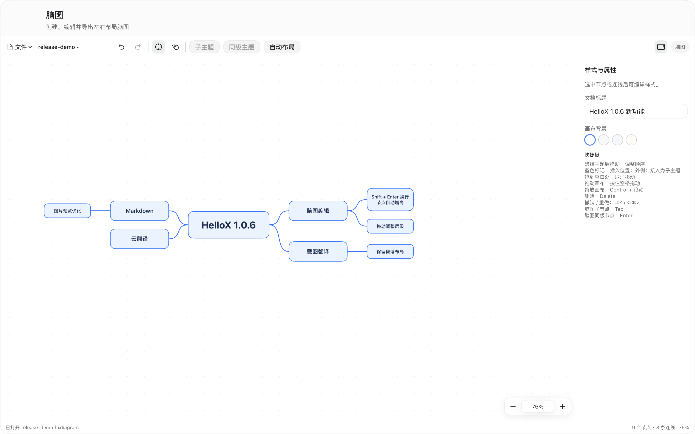

# HelloX v1.0.6

版本：1.0.6 · 构建：103



## 脑图

- 移除流程图功能及菜单栏、灵动岛、快捷键设置中的相关入口，保留独立脑图工具。旧流程图快捷键会被清理，其他快捷键设置保留。
- 脑图采用固定布局：先选中主题，再根据蓝色插入标记调整顺序；拖到其他主题后方时插入为同级主题，后续主题自动让位。
- 拖动时显示半透明主题预览、原位置淡化占位和蓝色插入标记，松手后提交布局。
- 新建主题按层级使用默认尺寸：一级 166 × 56、二级 132 × 40、三级及以下 118 × 34；同级尺寸一致，同一父主题下排序保留手动尺寸，移入其他父主题后整棵分支按新层级恢复默认尺寸。
- 支持跨父主题移动和接入：拖到主题外侧可接入为其子主题，全部下级主题随所属分支一起移动，支持撤销与重做。
- 拖到空白处保持原位，禁止将主题移动到自身的下级主题中；自动布局根据节点尺寸和子树高度预留空间。
- 首次打开仅预置中心主题与 4 个一级主题，使用统一蓝色系的填充、边框和连线；保留已有文档的自定义颜色，连线固定连接节点左右侧中央。
- 节点、文字、边框和连线按画布比例缩放，取消最小字号和四行截断限制。
- 双击节点后使用 `Shift + Enter` 换行，`Enter` 完成编辑；多行文字会自动撑高节点并重新计算分支间距。
- 继续支持 `.hxdiagram` 脑图文档及 PNG、PDF、SVG 导出；旧流程图文档不再支持打开，原文件不会被修改。
- 移除拖动时的红色十字参考线与工具栏的连线箭头，保留拖动接入主题。
- 按住空格切换抓手，拖动画布时显示握紧手势；松开恢复选择工具，文字编辑时空格正常输入。
- PNG 改为 4 倍分辨率直接绘制，保持画布比例，并继续提供 SVG 矢量导出。

## 翻译与 OCR

- 新增百度翻译与阿里云机器翻译，支持凭证配置、连接测试、自动识别源语言和服务商错误提示。
- 文本翻译、划词翻译和截图翻译共用服务配置；补充国内云翻译密钥申请教程和免费额度说明。
- 改进截图翻译的段落识别、菜单列表分行、字号还原和数字比例保护，减少侧栏标签被错误合并或放大的情况。
- 优化截图翻译的批量请求与版面保护，保留选中行、徽标和短标签的视觉层级。

## Markdown 与窗口交互

- Markdown 图片预览新增上一张、下一张、缩放、适应窗口、原始尺寸、旋转和拖动查看。
- 支持鼠标滚轮缩放及方向键、`+`、`-`、`0`、`1`、`Esc` 等快捷操作。
- 改进截图文字编辑焦点、窗口关闭和工具窗口交互。

## 下载与安装

支持 macOS 15 或更高版本，同时包含 Apple Silicon 和 Intel 架构。

- [下载 DMG 安装镜像](https://github.com/HelloX-ZhaoWen/hellox/releases/download/v1.0.6/HelloX-1.0.6.dmg)：打开后运行“安装 HelloX.pkg”。
- [下载 PKG 安装包](https://github.com/HelloX-ZhaoWen/hellox/releases/download/v1.0.6/HelloX-1.0.6.pkg)：直接打开安装，目标位置为 `/Applications/HelloX.app`。
- 校验文件：[DMG SHA-256](https://github.com/HelloX-ZhaoWen/hellox/releases/download/v1.0.6/HelloX-1.0.6.dmg.sha256) · [PKG SHA-256](https://github.com/HelloX-ZhaoWen/hellox/releases/download/v1.0.6/HelloX-1.0.6.pkg.sha256)

本次构建采用 ad-hoc 应用签名，安装包未使用 Developer ID 签名，也未经过 Apple 公证。

SHA-256：

```text
3f90679b5c3e4f477e36c06049cf87980835ce18afa3751fbed113ee7d03bbaa  HelloX-1.0.6.dmg
2ead27e319dd707d8f95c00fcfc12f7e128445a2805dd024ea8cfd1d5f23033d  HelloX-1.0.6.pkg
```

将安装包与对应的 `.sha256` 文件下载到同一目录后验证：

```sh
shasum -a 256 -c HelloX-1.0.6.dmg.sha256
shasum -a 256 -c HelloX-1.0.6.pkg.sha256
```
